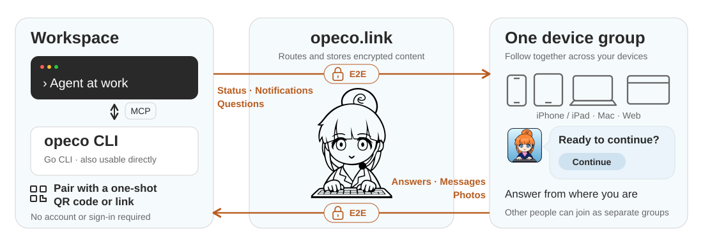

# opeco.link


opeco.link connects a short-lived Agent or CLI session to one or more device groups, letting people follow work, answer questions, and send feedback. Join through a one-shot QR code or pairing link using the PWA, iOS/iPadOS app, or macOS app. Subsequent notifications, status updates, questions, and responses are end-to-end encrypted.

There are no user accounts and no recovery flow. A session expires one day after its creator's last activity. The relay stores ciphertext and routing metadata, but does not receive application payloads in plaintext. The web client must still trust the JavaScript served by its origin.

The PWA is available at [opeco.link](https://opeco.link).



## Install

Download the archive for your platform from [GitHub Releases](https://github.com/yacchin1205/opeco-link/releases). Each release provides `opeco_<version>_<os>_<arch>.tar.gz` for Linux and macOS, `opeco_<version>_windows_<arch>.zip` for Windows, on amd64 and arm64, along with `checksums.txt`.

Verify the checksum, extract the archive, and place the `opeco` executable (`opeco.exe` on Windows) on your `PATH`:

```sh
shasum -a 256 --ignore-missing -c checksums.txt
tar -xzf opeco_<version>_<os>_<arch>.tar.gz
install -m 0755 opeco /usr/local/bin/opeco
```

### Install from source

Building requires the Go toolchain version declared in `go.mod`:

```sh
git clone https://github.com/yacchin1205/opeco-link.git
cd opeco-link
go build -o opeco ./cmd/opeco
```

Place the resulting `opeco` executable on your `PATH` as above.

## Shell CLI

Create a session in a POSIX-compatible shell (such as bash or zsh):

```sh
eval "$(opeco --title 'Deployment')"
```

`opeco` prints only shell exports to stdout, prints the one-shot pairing link and terminal QR code to stderr, and exits. Pair a device using that link or QR code, then run commands from the same shell:

```sh
opeco join
opeco status "Building"
opeco notify "Build completed"
opeco request "Continue deployment?" "Continue" "Stop"
opeco responses
opeco close-request REQUEST_ID
opeco color '#d9f2d0'
opeco pair
opeco close
unset OPECO_SESSION_FILE OPECO_SESSION_ID
```

There is no background process. `OPECO_SESSION_FILE` points to a private temporary state file; `OPECO_SESSION_ID` identifies the session. Each command loads and saves the creator keys, authenticated group history, open requests, and response cursor under an exclusive file lock. Child shells inherit the session. Running the initialization again creates a separate session; it does not close the previous one.

`responses` returns responses not previously read by this shell session, including free-form messages and verified photo paths. Run it again to check for new replies. `pair` prints an additional one-shot pairing link (and a QR code when stdout is a terminal). No local QR image server runs in shell mode; use `--interactive` for the browser-based QR viewer.

`close` deletes the remote session and its local state and attachments. It cannot unset variables in the parent shell, so unset them afterward. A command that discovers the session has expired also removes its local files and reports the API error. Merely leaving the shell does not close the session or remove its files; abandoned files remain until ordinary OS temporary-file cleanup. Losing the file means losing control of that session, with no recovery flow.

For local development, supply the service URL at initialization. Later commands use the saved URL:

```sh
eval "$(opeco --base-url http://127.0.0.1:8787 --title 'Local session')"
```

## Interactive CLI

Start a session:

```sh
opeco --interactive --title "Deployment"
```

The CLI prints a terminal QR code, its pairing URL, and a `QR image` URL such as `http://127.0.0.1:49152/qr/...`, then opens that URL in the default browser to display a full-size QR image without creating a file. Scan it with the receiving device. The CLI reports whether the browser opened, and reports when a new device group starts receiving the session.

The browser is not opened inside an SSH session, where it would appear on the remote display, and `--no-browser` suppresses it everywhere. The QR image URL is printed either way, so it can be opened by hand.

The terminal QR code depends on the cell geometry of a terminal, so it is drawn only when `opeco` writes to one; redirected or piped output gets the two URLs alone. Pass `--no-terminal-qr` to suppress it on a terminal as well, when the block characters are noise, when the terminal is too narrow to render them, or when the screen is being shared or recorded. The pairing URL is still printed either way and remains a temporary secret.

Session cards use a randomly selected pastel color by default. Pass `--color '#a1b2c3'` to choose an exact color at startup.

The PWA and native apps prepare a single-device cryptographic group automatically. On the device you want to add, open device management and choose "Add this device to another group" to create a 10-minute invitation. Open its link or scan its QR code on a device already in the destination group to approve the addition. The invitation authenticates the exact device request and the accepted signed group transition without revealing its approval secret to the relay. Invitation QR codes and links disappear as soon as approval is pending. A device can stop sharing only while two or more devices are in the group; it then returns automatically to single-device use. Different people should join the Agent session as separate device groups instead of sharing one group.

Available commands:

```text
join
pair
notify Deployment completed
status Waiting for approval
color #d9f2d0
request Continue deployment? | Continue | Stop
close-request REQUEST_ID
responses
close
quit
```

- `pair` creates another one-shot QR code for an additional device group.
- `color` changes the card color during the session; use `color random` to select another pastel color.
- `status` updates the card silently, unless the device is watching the session: long-press the opeco icon beside the session on iOS or macOS to toggle watching, and every status update then shows a generic status-updated alert, collapsed to the latest one. `notify` returns the item ID used to identify a later dismissal and shows a generic new-notification alert, while `request` shows a generic input-requested alert. Encrypted event content is not included in any OS alert. The PWA has no OS push notifications or session watching.
- `close-request` ends the identified request on connected devices.
- Each local QR image remains available for 10 minutes or until `opeco` exits. It is held only in process memory, and the response prevents browser caching. `pair` opens the new image in the browser under the same rules as startup.
- `responses` retrieves every choice response, request dismissal, and free-form message without selecting or aggregating them.
- `close` immediately deletes the session and removes its card from connected browsers.
- `quit` only exits the CLI. The session remains until its normal expiry, but its creator keys are lost with the process.

Use `--base-url` before the optional mode argument when connecting to a development deployment:

```sh
opeco --interactive --base-url http://127.0.0.1:8787 --title "Local session"
```

## MCP server

Run the same binary as a stdio MCP server:

```sh
opeco mcp
```

A typical MCP client configuration is:

```json
{
  "mcpServers": {
    "opeco-link": {
      "command": "/absolute/path/to/opeco",
      "args": ["mcp"]
    }
  }
}
```

The server exposes tools to create and pair sessions, wait for a device group, send notifications and status updates, change card colors, ask and close multiple-choice questions, receive choices, dismissals, free-form messages, and photos, and close sessions.

A session identifies the agent, so one MCP process runs one session: `session_create` returns the session already running instead of starting another, and omits the pairing fields once a device group has joined. Add a device group with `session_pairing_create`; start a separate session by closing the running one first.

Nothing pushes a response to the agent, so every send also hands over the responses received before it: `status`, `notify`, `session_color`, `request`, and `request_close` return them alongside their own result. Each response is handed over once, whether by a send or by `responses_wait`.

Protocol version 4 lets the PWA, iOS app, or macOS app send feedback containing text, up to five JPEG photos, or both. On iOS, a photo can be taken with the camera or selected through the system photo picker; the picker gives the app only the items the person chooses rather than requiring full-library access. On macOS, images can be pasted from the clipboard with Command-V or the explicit Paste button. The app reads the clipboard only in response to that action. The native clients fix orientation, limit the long edge to 2048 pixels, and normally compress toward 1 MiB. The current service policy rejects attachment ciphertext over 2 MiB; that value is returned by the reservation API and is not encoded as a permanent protocol limit.

Photos use a separate ECDH/HKDF context and full-file AES-256-GCM encryption. A private R2 bucket receives only the ciphertext; the encrypted response carries the media type, dimensions, nonce, plaintext length, ciphertext length, and checksum. `opeco` checks the manifest, checksum, GCM tag, and JPEG dimensions before writing plaintext. MCP returns the verified photo as a `file:` resource link.

Verified plaintext is written below the operating system's temporary directory, with a `0700` directory and `0600` file where those modes apply. It is removed when the local session is closed or replaced. This is ordinary temporary-file cleanup, not secure erasure: a crash can leave the file until the operating system cleans its temporary storage.

`session_create` and `session_pairing_create` return `qr_image_url` and `pairing_url`. They do not return a terminal QR code: an MCP result is rendered by an agent before a person sees it, and neither `opeco` nor the agent can check that block characters survived that rendering intact.

`opeco` opens `qr_image_url` in the default browser of its own machine and reports the outcome: `qr_opened` is true when the browser command succeeded, and `qr_open_error` otherwise explains why nothing opened, such as an SSH session, a missing `open` or `xdg-open`, or `--no-browser` in the MCP `args`. When nothing opened, ask the person to open `qr_image_url` in a browser.

The image URL is reachable only from the same machine as the `opeco` process. When MCP runs in a container, on a remote host, or across SSH without port forwarding, use the pairing URL instead.

## Security notes

- Treat an unused pairing QR code or URL as a temporary secret.
- Local QR images use an opaque, independently generated loopback URL. The URL contains no pairing data and expires after 10 minutes, but anyone who can view the image can use the underlying one-shot pairing secret. Interactive and MCP modes open the image in the default browser of the machine running `opeco`, so on a shared or remotely viewed display start `opeco` with `--no-browser`.
- Interactive and MCP session management keys exist only in process memory. Shell sessions keep keys and authentication state in an OS temporary directory (`0700`) and file (`0600`) where those modes apply. Treat that file as a secret: anyone who can read it can control the session and decrypt its messages. Do not share, back up, or commit it. Cleanup is not secure erasure, and missing keys are not recoverable.
- The relay can observe metadata such as timestamps, identifiers, and ciphertext sizes.
- Attachment objects in R2 are ciphertext only. They are removed after `opeco` has advanced past the response and polls again, or when the session expires; an uploaded attachment that is never committed can remain until session expiry.
- Compromise of the served web application, the browser profile, or the CLI process is outside the end-to-end encryption guarantee.
- Each app installation or browser profile belongs to at most one device group. Version 4 authenticates its membership and key history as a signed transition chain anchored during pairing. Sessions carry a device-and-group-signed descriptor whose creator key must be an actual P-256 ECDH public key and whose signer must be a member in the authenticated transition at that Session join. The descriptor proves the Group's participation, so the Session remains available if that signing device later leaves. Clients revalidate the join anchor and signatures on synchronization, and new responses use only the current usable group-key epoch. Adding a device creates a new transition; removing another device rotates the key immediately. A device leaving by itself signs only its removal marker, after which events pause until a remaining device verifies it and creates the fresh key. Removal cannot revoke ciphertext already received by that device.

See [CONCEPT.md](CONCEPT.md) for the product model and [DESIGN.md](DESIGN.md) for design rationale.

## Web tests

```sh
npm ci
npx playwright install --with-deps chromium
npm run check
npm run test:e2e
```

The browser suite requires Go and runs Chromium against a local Wrangler Worker on
`127.0.0.1:8790`. It builds the real CLI and uses its MCP interface for session
creation, events, and responses; it does not mock the relay or seed browser storage.
Each test starts with isolated browser storage. The phone, portrait-tablet, and
landscape-tablet projects check empty state, device management, joining sessions,
notification dismissal, answers, feedback, device addition/removal, and card layout.
These are Chromium viewport tests, not physical iPhone or Safari tests.

The `web` job runs both suites on pull requests. Stage screenshots and the HTML
report are retained as the `web-e2e-results` artifact; failures also retain browser
traces. Locally, use `npx playwright show-report` to inspect the same report.
`scripts/test-all.sh` includes the browser suite as well.

## Releases

GoReleaser builds archives for Linux, macOS, and Windows on amd64 and arm64. Pushing a semantic version tag creates a GitHub Release with those archives and `checksums.txt`:

```sh
git tag v2026.8.0
git push origin v2026.8.0
```

## License

Copyright 2026 Satoshi Yazawa.

Licensed under the [Apache License, Version 2.0](LICENSE).
Third-party dependencies retain their respective licenses.
CLI release archives include their license texts and notices in `licenses/`,
collected from the dependencies for each build target.
